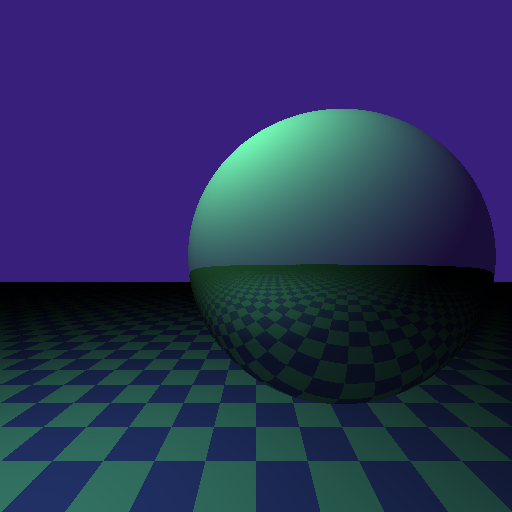

<!--
SPDX-FileCopyrightText: Stone Tickle <lattis@mochiro.moe>
SPDX-License-Identifier: MIT
-->

# meson ray tracer

A simple ray tracer written in the meson.build language.



## usage

```
$meson setup -Ddim=512 build
```

The output will be located at `build/output.ppm`.

## performance

Numbers are for the example render above on an Intel(R) Core(TM) i7-2640M CPU @
2.80GHz with 16G of memory.

| implementation | time      |
| -------------- | --------- |
| Meson          | 20h57m19s |
| muon           |    15m13s |

## implementation

This ray tracer is based on and inspired by Matt Taylor's
[cmake-raytracer](https://github.com/64/cmake-raytracer/blob/master/README.md).
In addition to not supporting floating point values, like CMake, Meson does not
allow user defined functions, and all objects are immutable.  It also does not
have while loops, only python-style for loops.

There are a few ways to implement a ray tracer given these constraints.  One way
would be to take the algorithm, inline all the function calls (including
recursively inlining the trace function) and wrapping it in a loop for each
pixel.  If I had taken this approach I likely would have written a code
generator to make development easier. Another method (the one I chose) is to
implement a tiny vm that interprets code somewhat resembling assembly.  This not
only seems more interesting to write, but also demonstrates that Meson
technically *can* have functions, macros, and practical undecidability.

The vm's instruction set mainly consists of arithmetic, vector operations, and
jumping instructions.  The latter being required for branching, loops, and
recursion.  Some other notable instructions are `push` and `pop` which are used
to make recursion more convenient.  Originally, there was also a proper return
stack and the program was broken up into more small functions.  However, due to
meson's immutable objects, popping from the stack is relatively expensive since
it requires the current stack to be copied.  The current implementation, with
just one function call, and a stack-less `ret` instruction, improves performance
while still allowing recursion where needed.

Because Meson has no while loop, the vm runs in a `foreach` loop.  Luckily Meson
does have a `range(x)` function, which can be used to create practically
infinite loops. The current implementation supports 4294967295 cycles, which at
roughly 381 cycles/s, would be exhausted after running for 130 days.  If this
isn't long enough for you, you can wrap the vm's loop inside another identical
foreach loop and get about 1,535,281,934 years of runtime!  muon, on the other
hand, runs at about 26,685 cycles/s so its corresponding numbers would be 45
hours with one foreach and 21,920,270 years with two.

The program is written as an array, with four elements per instruction.  The
first element is the instruction name, and the remaining three are arguments. By
convention, zero, aliased to \_, is passed for unused argument slots. For
example, the function 'print' can be called like this:

```
['print', 'argument', _, _]
```

Here is a while (true) loop:

```
['set', 'message', 'hello world!', _,
 'print', 'message', _, _
 'jmp', -2*ll, _, _,
]
```

The actual ray tracer part of this project is essentially a port of the cmake
ray tracer to this assembly-like meta-language.
